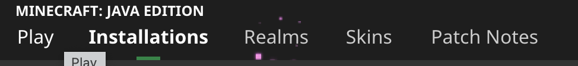
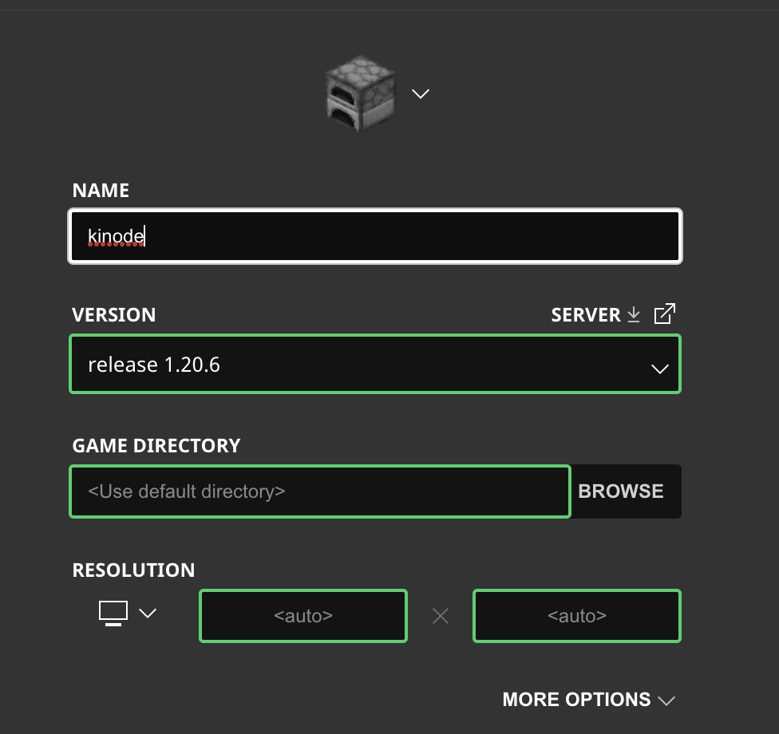
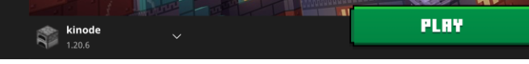

# Playtesting Setup

```bash
git clone https://github.com/basilesportif/mc-extension.git
```

## Planning Phase

### Server Setup - gamelord

Needs to be constantly online for the game to work.

```bash
cd gamelord
kit bs
```

Open UI at localhost:8080/gamelord:gamelord:basilesex.os. 
Under "Edit Lobby" define the game name and server address. (these are only displayed to players, and not used for any logic.)
Under "Configure Points" define the spawn points and goal post.
These should be displayed during planning phase.

### Players Setup - mcclient

There can be as many mcclients as you want, and they dont need to be constantly online.

```bash
cd mcclient
kit bs
```

Open UI at localhost:8080/mcclient:mcclient:basilesex.os.
To join a team specify the server/gamelord node, i.e. uncentered.os (or whoever is running the server), and enter your minecraft ID which can be found in your minecraft launcher (both inputs are necessary and important for the game to work properly.)

After joining the team, you can start making changes in the map. After pressing enter, the changes will propagate to all other players. You should also be able to see other players' changes in real time.

You can only chat with your team, and the other team will not be able to see your messages.

### Experimenting with Maps

Currently, the map we are using is found in the /mcclient/ui/public folder. If you want to experiment with a different map, all players should manually replace that folder with a new one containing the new map/world object.

This will be done automatically in the future.

## Playing Phase

### Server Setup - A Kinode <-> Minecraft Interface

#### Configuration:
Paper version: 1.20.6 (Minecraft Server hosting service): https://papermc.io/downloads/paper
Java version minimum: 21 (OpenJDK 21): https://openjdk.java.net/install/

#### Setup:
1. Set up Paper MC server (https://docs.papermc.io/paper/getting-started) (remember to have the startup script in the same folder as the Paper jar file.)
2. Compile a new version of the plugin: run `mvn clean install` in the `mc-plugin` folder.
3. Add plugin to the server (https://docs.papermc.io/paper/adding-plugins). 
4. Install(kit bs gamelord) and (kit bs mcdriver)
5. Start Minecraft Server. (use `java -Xms4G -Xmx4G -jar paper-1.20.6-148.jar --nogui` or `sh {name of startup script}` in the folder with the Paper Jar with the appropriate plugin jar in the server's plugin folder).

@punctumfix - please add instructions for loading the map (.obj files) into the server.

### Client/Player Setup

1. In you minecraft client click on "Installations" tab:

2. Click on "New installation".
3. Find release 1.20.6.:

4. Click "Create".
5. Go back to "Play" tab and select the new installation on the lower left:

6. Play!
7. Join the server specified in McClient UI from your Minecraft Client.
